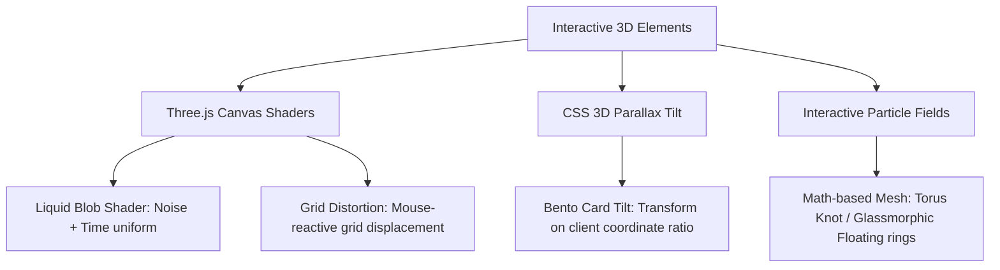

# 🌀 Journey Catalog & God-Tier Design Blueprint

This blueprint outlines a comprehensive strategy to transform your personal website from a "traditional resume portfolio" into a high-octane, pixel-perfect, GenZ-modernised **"Journey Catalog"** that highlights your personality, design instincts, and ability to build and deliver software.

---

## 1. Vibe Check: Current State Analysis

### What's Working Well (The Strengths)
1. **Interactive Loading Sequence**: The VT323-powered typing preloader with a smooth SVG clip-mask transition is extremely satisfying and sets a high-tech tone immediately.
2. **Context-Powered Integration**: Your use of context for audio controls, site-wide theme switching (Charcoal, Crimson, Sunlight, Neon), and location-aware weather APIs demonstrates strong core engineering.
3. **Interactive Terminal**: The developer terminal mockup on the About page is engaging and acts as a great interactive playground for tech recruiters.
4. **Dynamic Typography**: The `TextPressure` font variation component shows that you have an eye for modern, experimental layout techniques.

### Areas for Elevation (The Gaps)
1. **The Resume Vibe**: Sections like "Skills," "Work Experience," and "Education" use standard, slightly generic bento layouts. They feel like a curriculum vitae rather than a lived-in engineer's log.
2. **The Photography Dilemma**: Street photography (like photos of cats, greenery, beaches) is high quality, but it dilutes your brand as an engineer who *designs, builds, and delivers*. It feels like a generic hobby gallery.
3. **Static Projects**: The project list is a two-column grid that lists details but doesn't feel "alive." It lacks micro-interactions and tactile feedback on mouse hover.
4. **Missing 3D/Dynamic Physics**: While three.js dependencies are installed, they aren't utilized on the core layout to provide depth, texture, or motion.

---

## 2. Re-envisioning the Journey (GenZ / Tech Catalog Vibe)

### Instead of a Resume ➡️ An Engineer’s Build Log
Instead of static headings, structure your site as a **chronological catalog of your digital journey**:
* **The "Chai & Code" Counter**: Real-time stats or interactive counters showing logs of what you've shipped:
  * `70+ Repositories Maintained`
  * `X.XX Million Pixels Pushed`
  * `0.00% Tolerated Latency`
* **WIP / Experiment Graveyard**: Recruiters love seeing that you build things even if they break. Create a subsection for "Failed/Archived Experiments" where you document what went wrong and what you learned. This proves you build and learn fast.
* **The Chronological Timeline**: Convert the Experience section into a visual git-graph layout (similar to a branch merge diagram) showing major milestones:
  * `commit: VOIS data analyst launch`
  * `commit: Infosys NGO portal shipped`
  * `merge: Acharya graduation expected`

### Rebranding the Art Page ➡️ "Creative Lab & Visual Sandbox"
You shouldn't delete your creative work—design is one of your biggest superpowers! Instead, rebrand `/photography` to `/creative` (or `/sandbox`) and filter the content:
1. **Re-frame "Art & Photos" in Nav to "Sandbox" or "Creative Lab"**: Keep it focused on the intersection of design + code.
2. **Filter out general street photos**: Focus exclusively on **UI/UX design mockups** (like your VOIS mockup), **graphic designs** (posters), and **interactive code experiments** (like the `TextPressure` text and WebGL shaders).
3. **Highlight "Visual Assets & Lighting Research"**: If you want to keep photography, frame it as study-cases for UI lighting, gradient layouts, and spatial composition. Write 1-2 sentence logs explaining how a photograph inspired a UI palette.

---

## 3. Creating Code-Driven 3D & WebGL (No GLB Files Required)

Creating and loading `.glb` files is heavy, hurts Lighthouse performance scores, and takes hours to model. Since `@react-three/fiber` and `three` are already in your `package.json`, you can implement **code-driven 3D and physics**:

### Option A: CSS 3D Bento Card Tilt (Fast, high impact)
An extremely premium effect where cards tilt towards your cursor. You can build this in a simple React hook with no extra packages:
* On mouse move, calculate the mouse coordinates relative to the card's center.
* Apply a `transform: perspective(1000px) rotateX(${rotX}deg) rotateY(${rotY}deg)` CSS property dynamically.

### Option B: Code-Generated Glassmorphic Torus Knot
Render a rotating geometric shape in a Canvas wrapper on the homepage using `@react-three/fiber`:
* A **TorusKnotGeometry** or a floating **glassmorphic mesh** with a `MeshTransmissionMaterial`.
* By applying real-time refraction and mouse-reactive rotation, you get an ultra-modern 3D visual using 0kb of model assets.

### Option C: Mouse-Reactive WebGL Grid Distortion
A 2D shader background representing a pixelated coordinate plane. Moving the cursor "pinches" or "warps" the grid lines like a gravity well, illustrating your domain name (`vineetnotfound` / antigravity).

---

## 4. God-Tier Aesthetics (The Modern Polish)

To give the website a tactile, modern, and highly polished feel:

1. **Noise/Film Grain Overlay**: Add a fixed, semi-transparent CSS noise animation overlay. It cuts out the clinical look of digital colors and gives a beautiful, warm paper/glass texture to the background.
2. **CRT Scanline / Glow Effects**: For themes like Charcoal and Crimson, add a togglable retro CRT terminal overlay on the terminal window. Let users type commands with realistic micro-vibrations of the font.
3. **Haptic Audio (Keyboard Typings & Clicks)**: Since you already have an `AudioContext`, add subtle click sounds when:
   * Users hover over navbar icons.
   * Users press keys in the About console CLI (mechanical keyboard sounds).
4. **Theme Transitions**: Instead of a simple CSS background transition, create a "Screen Glitch" or "Vertical Sweep" wipe animation when the theme cycles. It makes the switch feel like a physical state change.

---

## 5. Technical Implementation Steps

Here is the step-by-step roadmap to implement this blueprint:

### Step 1: Nav & Route Reorganization
* **Nav Rebrand**: Rename "Art & Photos" to "Sandbox" or "Creative".
* **Delete Street Photos**: Filter `GALLERY_ITEMS` inside `src/app/photography/page.tsx` to remove generic street photos, focusing instead on UI/UX mockups, Figma links, and graphic posters. Move this file under `src/app/creative/page.tsx`.

### Step 2: Implement CSS 3D Card Tilt
* Create `src/app/hooks/useTilt.ts` to track cursor movement and apply 3D transform strings to references.
* Apply this hook to the bento cards in `src/app/components/home.tsx`.

### Step 3: Implement Three.js Math Mesh
* Create an interactive particle field or a refracting 3D shape (Torus Knot) inside `src/app/components/render/` using `@react-three/fiber` to replace the static image blob on the landing page.

### Step 4: Add Film Grain and Grid Backgrounds
* Implement a persistent CSS film grain keyframe loop in `src/app/globals.css`.
* Add a vector-based grid line background that coordinates with the selected theme's accent color.
